# tldag

## Development Environment

### Directory Structure

Directory | Description
--- | ---
C:\amgldev|root directory
&#x2517; eclipse|Eclipse IDE
&#x2517; workspace|Eclipse workspace

### Eclipse

#### Installation

Use the installer provided by eclipse.org to install Eclipse

TLDAG is an Eclipse Rich Client Platform (RCP) application.

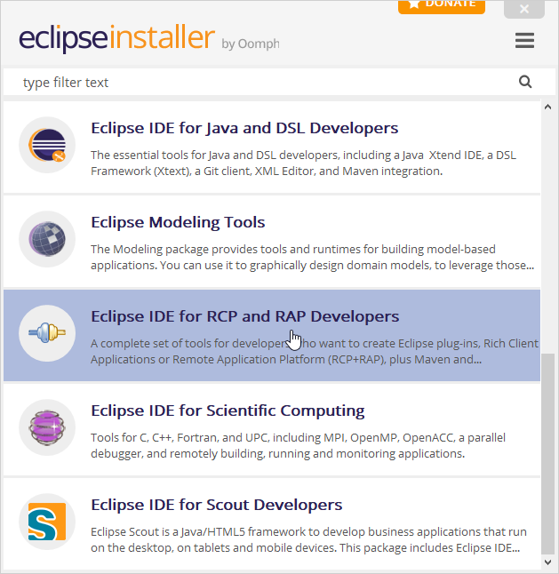

TLDAB uses the JustJ JRE delivered with Eclipse. Select it for development, too.

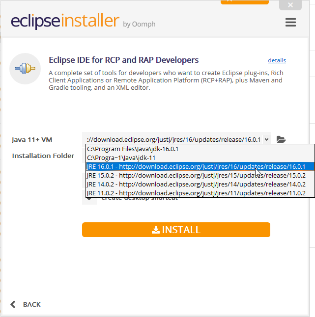

Choose ```C:\amgldev``` as installation folder. The installer creates the ```eclipse``` folder beneath it.

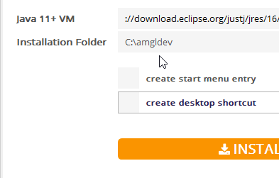

#### Configuration

Select ```C:\amgldev\workspace``` as workspace and check the ```do not ask again```.

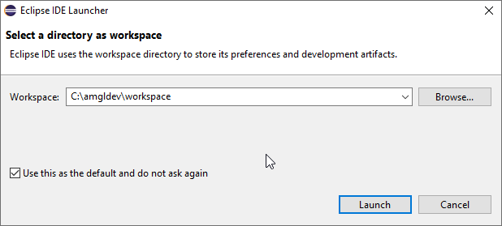

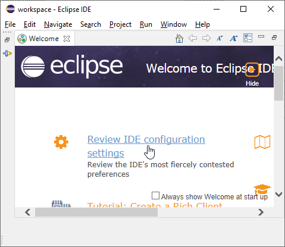

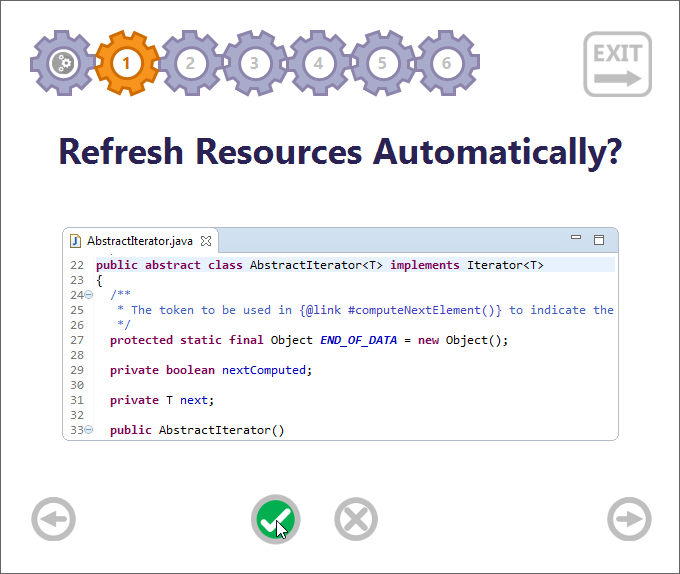

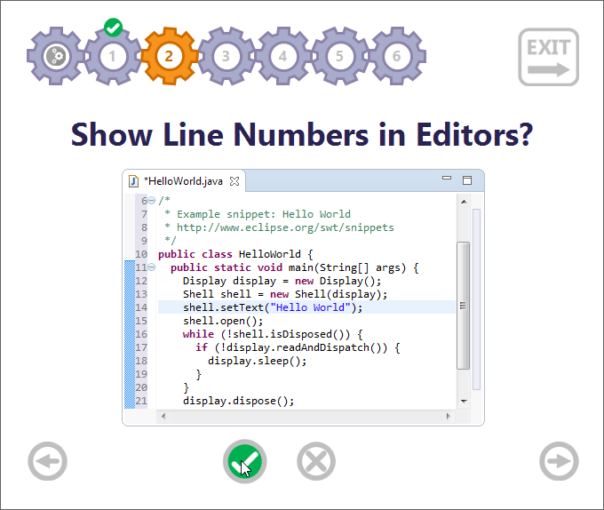

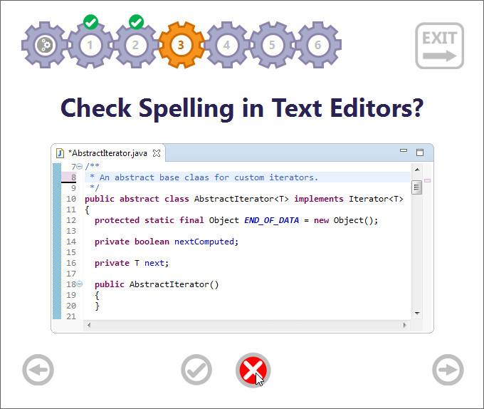


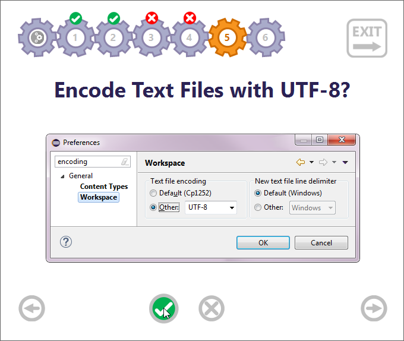

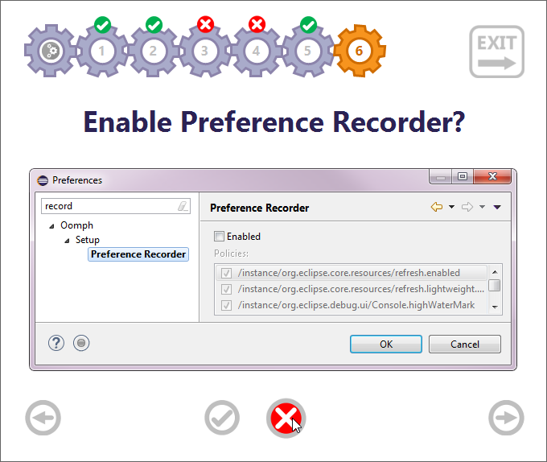

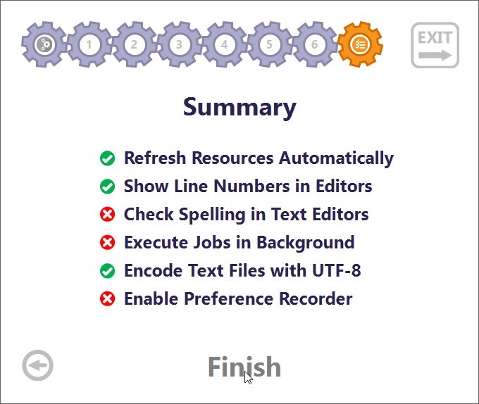
